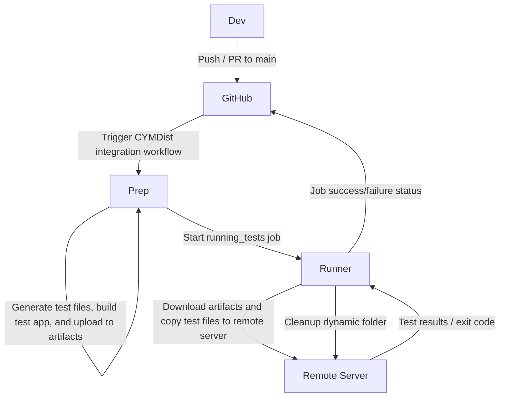
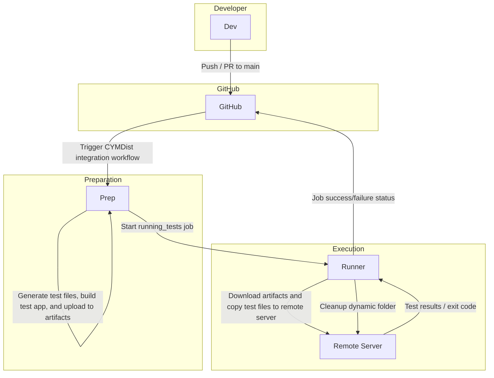

# Mermaid workflow diagram

## Without groups

```mermaid
flowchart TD
    Dev[Dev] -->|Push / PR to main| GH[GitHub]
    GH -->|Trigger CYMDist integration workflow| Prep[Prep]
    Prep -->|Generate test files, build test app, and upload to artifacts| Prep
    Prep -->|Start running_tests job| Runner[Runner]
    Runner -->|Download artifacts and copy test files to remote server| Srv[Remote Server]
    Srv -->|Test results / exit code| Runner
    Runner -->|Cleanup dynamic folder| Srv
    Runner -->|Job success/failure status| GH
```

## With Groups

```mermaid
flowchart TD
    subgraph DevSide[Developer]
      Dev[Dev]
    end

    subgraph GHSide[GitHub]
      GH[GitHub]
    end

    subgraph PrepStage[Preparation]
      Prep[Prep]
    end

    subgraph Exec[Execution]
      Runner[Runner]
      Srv[Remote Server]
    end

    Dev -->|Push / PR to main| GH
    GH -->|Trigger CYMDist integration workflow| Prep
    Prep -->|Generate test files, build test app, and upload to artifacts| Prep
    Prep -->|Start running_tests job| Runner
    Runner -->|Download artifacts and copy test files to remote server| Srv
    Srv -->|Test results / exit code| Runner
    Runner -->|Cleanup dynamic folder| Srv
    Runner -->|Job success/failure status| GH
```
