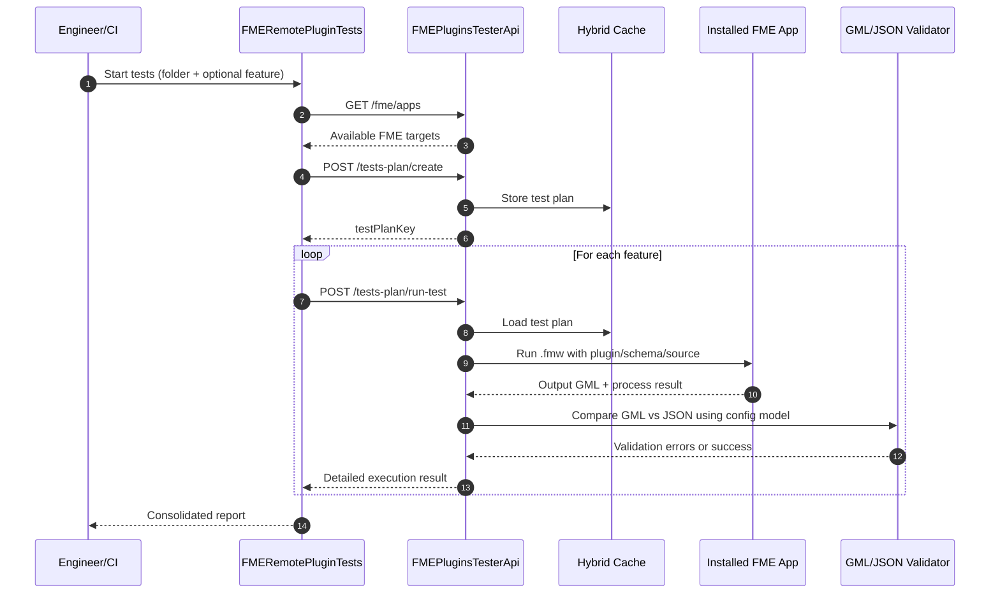
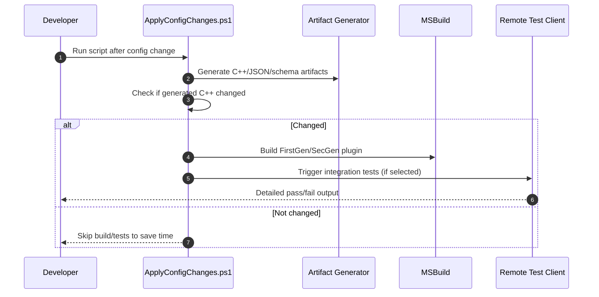

# Integration Test Architecture Note

## Purpose
This branch introduces a practical remote integration-test architecture for CYME FME plugins. The goal is to make plugin validation easier to trigger, easier to repeat, and less tied to manual local execution.

## What Was Added
- A new API service (`FMEPluginsTesterApi`) that centralizes test-plan creation and test execution.
- A new remote console client (`FMERemotePluginTests`) that calls the API and prints test status per feature and FME app.
- Script automation (`ApplyConfigChanges.ps1` + helper scripts) to connect generation, plugin rebuild, and optional integration-test execution in one flow.
- Solution/test project restructuring so unit tests and remote tests are in a dedicated `test` tree.

## Architecture (User Language)
- Think of the new flow as a **two-part system**:
  - **Control plane**: client + scripts that decide what to test and when.
  - **Execution plane**: API service that prepares FME, runs scripts, and validates outputs.
- A test plan groups:
  - Which FME installations to use
  - Where plugin DLLs/schemas/scripts/sources are
  - Which CYME config file to use for validation rules
- For each feature test:
  - The API runs the corresponding `.fmw`
  - Produces output GML
  - Compares output values with JSON source and configured behavior rules
  - Returns detailed per-FME execution logs and validation status

## Sequence Diagram

## Execution Workflow

## Team-Level Benefits
- Faster feedback on behavior regressions after config or generation updates.
- Standardized remote execution against multiple FME app variants.
- Better traceability with structured API responses and service logs.
- Easier onboarding: one script-driven workflow instead of many manual steps.

## Team-Level Considerations
- The API currently targets `net10.0`; environment readiness is required.
- Shared utility/FME process classes are temporary copies and should be replaced by proper package references when available.
- The service depends on correct file-path conventions and deployment environment permissions.
