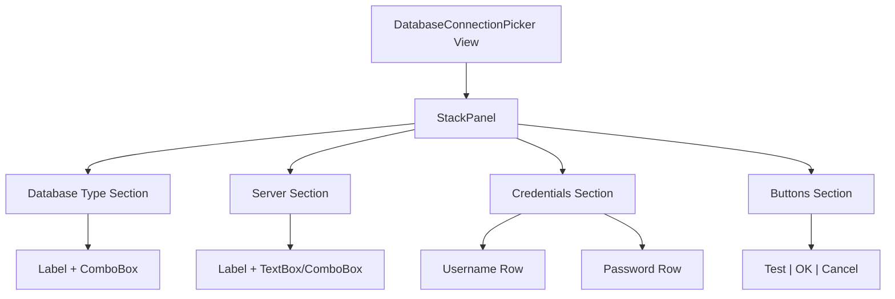

Great question! Here are the best approaches to describe a UI mockup that I can work from:

## 1. **XAML/XML Structure** (Best for Avalonia UI)
Since you're building Avalonia, describe the layout using XAML-like structure:

```
View: DatabaseConnectionPickerView
├── StackPanel (Vertical, Spacing=8)
│   ├── Section: Database Type Selection
│   │   └── Grid (2 columns: label, control)
│   │       ├── TextBlock: "Database Type"
│   │       └── ComboBox: [SQL Server | PostgreSQL | Oracle]
│   │
│   ├── Section: Server Connection
│   │   └── Grid
│   │       ├── TextBlock: "Server"
│   │       └── TextBox/ComboBox: editable server list
│   │
│   └── Section: Credentials
│       ├── Grid
│       │   ├── TextBlock: "Username"
│       │   └── TextBox: username input
│       └── Grid
│           ├── TextBlock: "Password"
│           └── TextBox: password input (masked)
```

## 2. **ASCII Art Mockup**
Good for quick visual representation:

```
┌─────────────────────────────────────────┐
│  Database Connection Picker             │
├─────────────────────────────────────────┤
│ Database Type:  [SQL Server        ▼]  │
│                                         │
│ Server:         [server-name       ▼]  │
│                                         │
│ Username:       [________________]     │
│                                         │
│ Password:       [••••••••••••]         │
│                                         │
│               [Test]  [OK]  [Cancel]   │
└─────────────────────────────────────────┘
```

## 3. **Structured Text Specification** (Most Detailed)
Create a markdown document with sections:

```markdown
# View: DatabaseConnectionPicker

## Layout
- **Container**: StackPanel (vertical, 8px spacing)
- **Color Scheme**: Light theme, dark text

## Sections

### 1. Database Type Selection
- **Label**: "Database Type" (170px fixed width)
- **Control**: ComboBox, editable=false
- **Items**: SQL Server, PostgreSQL, Oracle, SQLite
- **Default**: SQL Server

### 2. Server Configuration
- **Visibility**: Conditional based on database type
- **Label**: "Server" or "Host"
- **Control**: ComboBox, editable=true (with history)
- **Features**: Dropdown on focus shows suggestions

### 3. Credentials Section
- **Visibility**: Conditional (if not using Windows Auth)
- **Fields**: 
  - Username (TextBox, 50px min-width)
  - Password (TextBox with PasswordChar="•")
- **State**: Enabled only if credentials required

### 4. Actions
- **Buttons**: [Test Connection] [OK] [Cancel]
- **Alignment**: Right-aligned
```

## 4. **Mermaid Diagram**
Good for layout flow:



## **My Recommendation** 

**For Avalonia projects, use a combination:**

1. **Start with ASCII art** for the overall layout
2. **Add XAML structure** showing component hierarchy
3. **Include a specification table** for key properties:

| Component           | Type      | Binding              | Visibility       | Notes                 |
| ------------------- | --------- | -------------------- | ---------------- | --------------------- |
| Database Type Label | TextBlock | -                    | Always           | 170px width           |
| Database Type Combo | ComboBox  | SelectedDatabaseType | Always           | -                     |
| Server Label        | TextBlock | -                    | ShowServerPicker | -                     |
| Server Combo        | ComboBox  | ServerName           | ShowServerPicker | Editable, suggestions |

**Try this format for your next view**, and I'll implement it precisely following SOLID principles and your code style preferences!