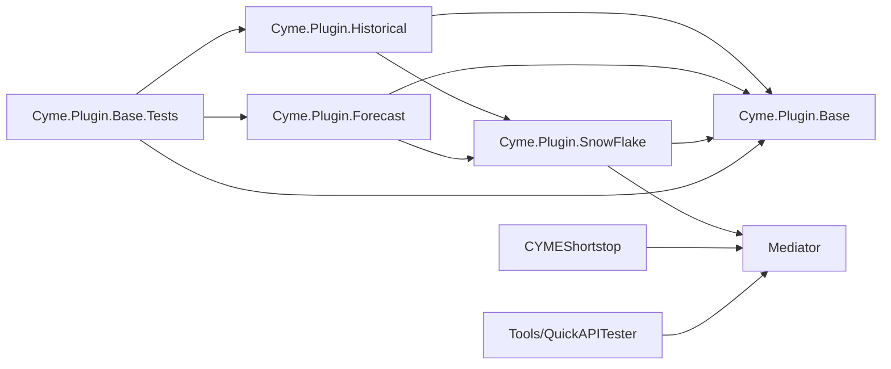
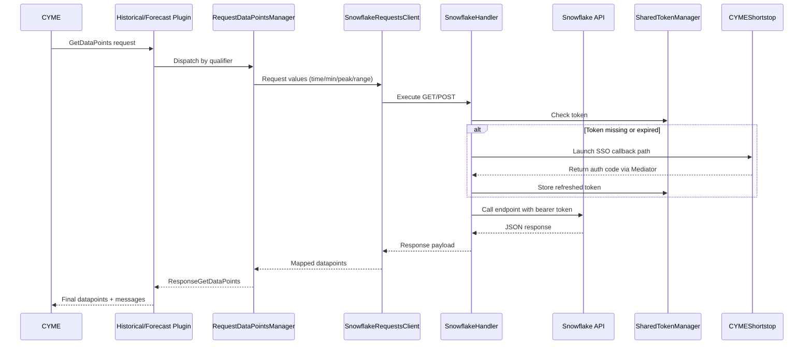

### Project Dependency Graph

```mermaid
flowchart LR
    H[Cyme.Plugin.Historical]
    F[Cyme.Plugin.Forecast]
    B[Cyme.Plugin.Base]
    S[Cyme.Plugin.SnowFlake]
    M[Mediator]
    C[CYMEShortstop]
    Q[Tools/QuickAPITester]
    T[Cyme.Plugin.Base.Tests]

    H --> B
    H --> S
    F --> B
    F --> S
    S --> B
    S --> M
    C --> M
    Q --> M
    T --> B
    T --> H
    T --> F
```

### Runtime Sequence (Typical Request)

```mermaid
sequenceDiagram
    participant CYME
    participant Plugin as Historical/Forecast Plugin
    participant DPM as RequestDataPointsManager
    participant Client as SnowflakeRequestsClient
    participant Handler as SnowflakeHandler
    participant API as Snowflake API
    participant Token as SharedTokenManager
    participant SS as CYMEShortstop

    CYME->>Plugin: GetDataPoints request
    Plugin->>DPM: Dispatch by qualifier
    DPM->>Client: Request values (time/min/peak/range)
    Client->>Handler: Execute GET/POST
    Handler->>Token: Check token
    alt Token missing or expired
        Handler->>SS: Launch SSO callback path
        SS-->>Handler: Return auth code via Mediator
        Handler->>Token: Store refreshed token
    end
    Handler->>API: Call endpoint with bearer token
    API-->>Handler: JSON response
    Handler-->>Client: Response payload
    Client-->>DPM: Mapped datapoints
    DPM-->>Plugin: ResponseGetDataPoints
    Plugin-->>CYME: Final datapoints + messages
```
