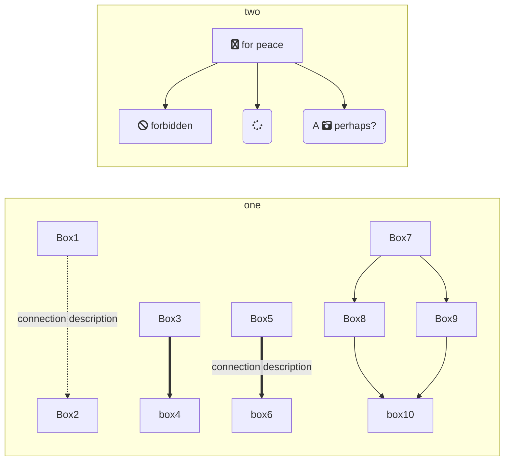
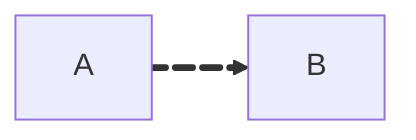
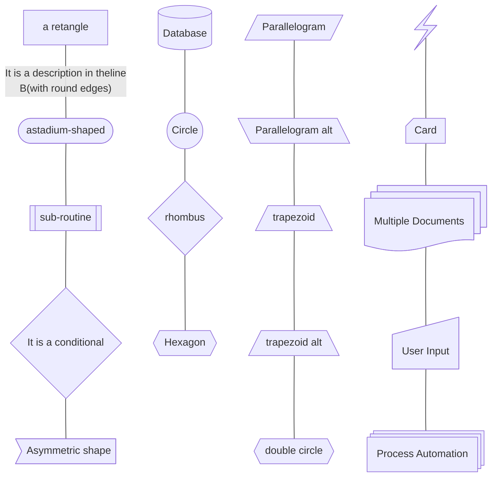

# Mermaid

## Diagram types

- erDiagram
- graph/flowchart [DIRECTION]
  - TD[TB] -> Top to Down
  - LR -> Left to Right
  - BT -> Bottom to Top
  - RL -> Right to Left
- sequenceDiagram
-



``` 
   A & B --> C & D

   it is the same as
    A --> C
    A --> D
    B --> C
    B --> D

```





Other types of shape `id@{shape: [type]}` : https://mermaid.ai/open-source/syntax/flowchart.html#complete-list-of-new-shapes

## Shapes type


