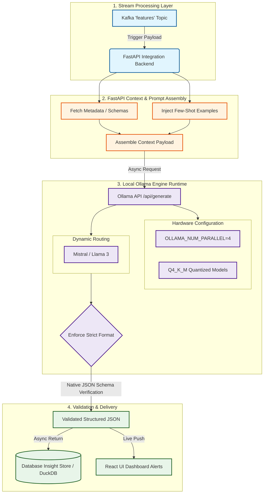

To extract the highest performance from a local model like **Llama 3** or **Mistral** within a mining telemetry architecture, your integration design must focus heavily on **efficiency, latency management, and structural formatting**. Mining operations generate a massive volume of data, meaning your local inference setup needs strict engineering constraints to prevent it from lagging or hallucinating.

Here is how you should design the integration to get the best out of these models.

### 1. Model Selection Strategy

For a local deployment inside a mine infrastructure, your choice depends on your host hardware (RAM/VRAM) and the specific task:

- **Mistral 7B (or Nemo 12B):** Excellent choice for **tool calling and data routing**. Mistral models are historically highly efficient at understanding structured schemas and generating clean JSON payloads.
    
- **Llama 3 (8B or 70B):** Best for **reasoning, synthesis, and conversational Q&A**. Llama 3 handles complex contextual prompts exceptionally well, making it ideal for taking the final data output and generating the actual fleet advice for the dispatcher.
    
- **Alternative Suggestion (DeepSeek-R1 / Qwen-2.5-Coder):** If your primary goal is Text-to-SQL query generation over your operational database, look at the **Qwen-2.5-Coder** series or a reasoning-optimized model. They outperform standard models at mapping complex relational schemas and writing precise, syntax-perfect SQL without guessing columns.
    

### 2. The Native Ollama Integration API (Structured JSON)

Do not let the model write free-form text if it is passing data to a React UI or another backend service. Use Ollama’s native **Structured Outputs** feature by passing a explicit JSON Schema in the API call. This forces Mistral/Llama to respond _only_ in the format your system expects.

#### Architecture Integration (FastAPI Backend Python Snippet):

Python

```
import requests

def analyze_fleet_features(computed_features):
    # Enforce a strict JSON schema directly in the Ollama API request
    payload = {
        "model": "mistral",
        "prompt": f"Analyze these mining equipment features: {computed_features}",
        "stream": False,
        "format": {
            "type": "object",
            "properties": {
                "behavioral_summary": {"type": "string"},
                "risk_level": {"type": "string", "enum": ["low", "medium", "high"]},
                "recommended_action": {"type": "string"}
            },
            "required": ["behavioral_summary", "risk_level", "recommended_action"]
        }
    }
    
    response = requests.post("http://localhost:11434/api/generate", json=payload)
    return response.json()["response"]
```

_This eliminates the need for expensive post-parsing or relying on regular expressions to extract clean data from the LLM response._

### 3. Context Window Optimization via Few-Shot Examples

Local models can forget constraints or hallucinate patterns if their prompt is purely instructional. To get corporate-grade accuracy without fine-tuning, implement **Few-Shot Prompting** inside your integration. Give the model explicit examples of input data matched with desired output data.

> **Integration Blueprint Pattern:**
> 
> - **System Prompt:** You are an industrial mining fleet safety analyst.
>     
> - **Example 1 Input:** `{"avg_speed": 82, "hard_brakes": 42, "anomaly": "yes"}`
>     
> - **Example 1 Output:** `{"behavioral_summary": "Aggressive high-speed driving with chronic brake spikes.", "risk_level": "high", "recommended_action": "Flag operator for speeding retraining."}`
>     
> - **Real Input:** _[Insert current streaming features from Kafka]_
>     

### 4. Separate Your Inference Streams (Asynchronous Agents)

Mining telemetry is constant, but LLM generation takes time (latency). If your model takes 2 seconds to think, you cannot block your Kafka streaming data pipeline waiting for a response.

Your integration must use an **Asynchronous Worker Queue Pattern**:

1. **Fast Path (Stream Processor):** Continuously aggregates telemetry and saves it to the database.
    
2. **Slow Path (Ollama Agent):** A background worker thread consumes a "features" Kafka topic, sends the batch payload to Ollama, and asynchronously writes the resulting text insights back into the "insights" topic when complete.
    

This guarantees your app interface stays responsive, even if the local LLM is working under a heavy computational load.

### 5. Hardware & Runtime Tuning Checklist

To ensure your integration runs at top speed inside a local server room, configure your Ollama runtime environment variables with these production metrics:

- **`OLLAMA_NUM_PARALLEL=4`:** Allows Ollama to process multiple user dashboard questions or streaming data alerts simultaneously rather than queuing them sequentially.
    
- **VRAM Quantization:** Use `Q4_K_M` or `Q8_0` quantized models. They require significantly less VRAM, allowing a 7B or 8B model to easily fit entirely into a standard local GPU (like an RTX 3090/4090 or A100), maximizing your tokens-per-second output.
    


Here is a comprehensive Mermaid chart that materializes the integration architecture, highlighting how to split the fast-path telemetry from the asynchronous local LLM (Mistral/Llama) reasoning engine, while strictly enforcing structured JSON schemas.

Snippet de código



### 🔍 Breakdown of the Integration Loop

1. **The Async Trigger:** The `features` topic from your Kafka layer streams the compressed telemetry aggregations (e.g., hard-brake frequency, average RPM). Your FastAPI backend acts as a non-blocking consumer to keep processing fast.
    
2. **Context Customization:** Before hitting the model, the orchestrator pairs raw values with clear contextual markers—injecting static machine asset categories, shift information, and fixed **Few-Shot Examples** to guide the model's interpretation.
    
3. **Optimized Local Engine Engine:** The runtime parameters are fine-tuned directly on your secure machine (`OLLAMA_NUM_PARALLEL=4` and low VRAM quantization memory layouts). Mistral or Llama process the request without freezing concurrent queries.
    
4. **Deterministic Validation Blueprint:** The integration never processes loose string text from the API. Ollama validates the layout against your pre-set JSON structure natively, immediately yielding clean analytics that populate your React alert boards and DuckDB engine automatically.